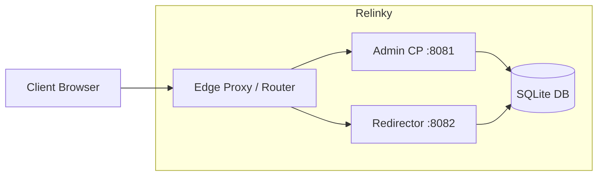
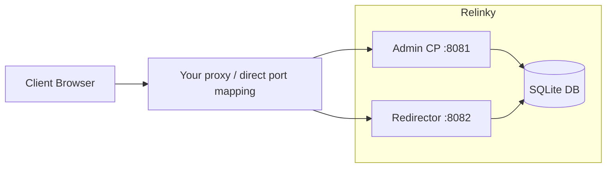
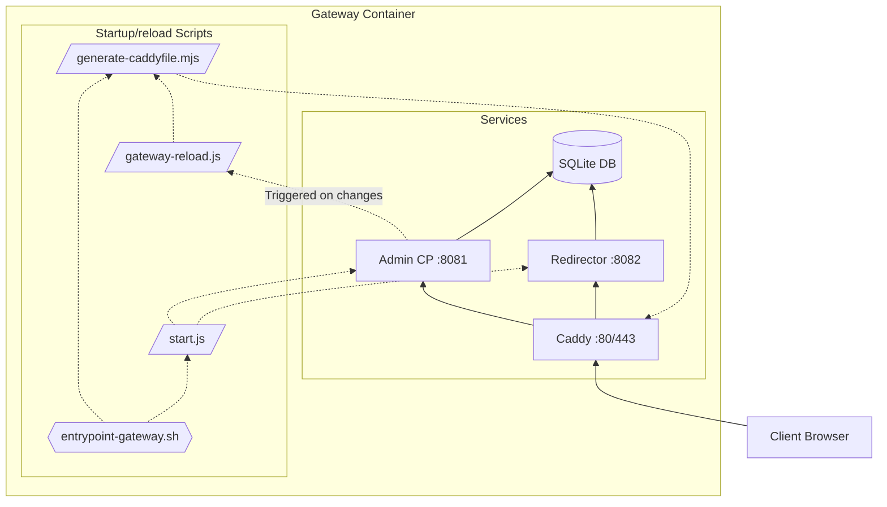
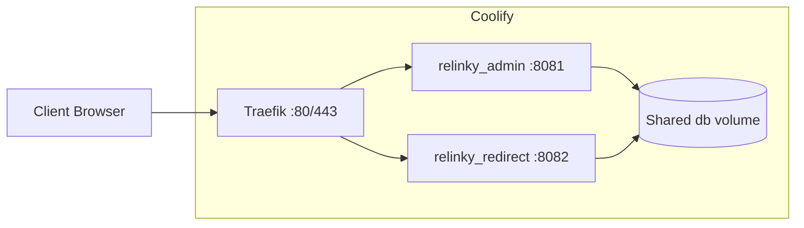

# Relinky

Minimal self-hosted link redirector with admin UI, stats, SQLite storage and API for automation

### Features

- Multiple domains
- Link expiration
- Support for links with hash parts
- Optional query string forwarding
- Basic stats overview (full stats recording)
- API for automation with source IP restrictions
- JSON Import/export in UI
- Importing from Rebrandly and Kutt 

### Table of contents

- [Architecture overview](#architecture-overview)
- [Hosting modes](#hosting-modes)
  - [1. Plain Docker](#mode-1-plain-docker-docker-composeyml)
  - [2. Gateway, embedded Caddy](#gateway-mode-only-docker-composegatewayyml)
  - [3. Coolify](#coolify-mode-only-docker-composecoolifyyml)
- [Development](#development)
- [Future plans](#future-plans)
- [Support](#support)
- [MIT License](#mit-license)

---

## Architecture overview



Databases:

- `db/main.db` — settings/defaults/api keys
- `db/redirectables.db` — domains/links/target URLs
- `db/stats.db` — redirect stats
- `db/logs.db` — audit-like logs

---

## Hosting modes

### Mode 1: Plain Docker ([`docker-compose.yml`](./docker-compose.yml))



Use when:

- You already have your own reverse proxy/TLS setup
- Or local/dev usage where you do not need automatic TLS

Start:

```bash
docker compose up -d
```

### Mode 2: Gateway, embedded [Caddy](https://github.com/caddyserver/caddy) ([`docker-compose.gateway.yml`](./docker-compose.gateway.yml))

Use when:

- You run on a VPS and want Relinky to manage routing/certs itself
- Host ports `80/443` are available (or intentionally remapped)



#### Workflow

1. Container entrypoint starts and sets gateway defaults (loopback binds + Caddyfile path).
2. Entrypoint runs DB init and generates the initial Caddyfile from current DB domains.
3. Entrypoint starts Node services (`start.js`) and Caddy (`caddy run ...`).
4. When domains are created/removed in admin API, backend schedules a non-blocking gateway reload.
5. Reload helper regenerates Caddyfile from DB and executes `caddy reload`.

Script pointers for this flow:

- [`docker/entrypoint-gateway.sh`](./docker/entrypoint-gateway.sh) (startup order, process launch)
- [`start.js`](./start.js) (spawns admin + redirector)
- [`scripts/generate-caddyfile.mjs`](./scripts/generate-caddyfile.mjs) (reads DB domains, writes Caddyfile)
- [`app/shared/gateway-reload.js`](./app/shared/gateway-reload.js) (regenerate + `caddy reload` on domain changes)
- [`app/admin/backend/api.js`](./app/admin/backend/api.js) (calls `scheduleGatewayReload()` after domain mutations)

#### Setup

Required environment variables:

- `ADMIN_PASSWORD_HASH` (or `ADMIN_PASSWORD_HASH_B64`)
- `RELINKY_ADMIN_HOST` (required)
- `ACME_EMAIL` (recommended for real HTTPS)

Start:

```bash
export ADMIN_PASSWORD_HASH='<sha512-crypt-hash>'
export RELINKY_ADMIN_HOST='admin.example.com'
export ACME_EMAIL='you@example.com'
docker compose -f docker-compose.gateway.yml up -d
```

After startup:

1. Open `https://admin.example.com`
2. Log in
3. Add redirect domains in Settings
4. Ensure those domains resolve to the same server
5. Relinky regenerates Caddy config and reloads Caddy automatically

Port/cert notes:

- Let’s Encrypt HTTP-01/TLS-ALPN needs public `80/443`
- For non-standard public ports, use `RELINKY_CADDY_TLS_INTERNAL=1` for self-signed/internal TLS
- `RELINKY_CADDY_HTTP_PORT`/`RELINKY_CADDY_HTTPS_PORT` control Caddy bind ports inside container
- `RELINKY_GATEWAY_HOST_HTTP`/`RELINKY_GATEWAY_HOST_HTTPS` control published host ports

### Mode 3: [Coolify](https://github.com/coollabsio/coolify) / Traefik ([`docker-compose.coolify.yml`](docker-compose.coolify.yml))

Use when:

- Coolify/Traefik already terminates TLS and owns host `80/443`

Do not use gateway mode here unless you intentionally want double proxy.

Why split services:

- Coolify domain mapping is per service
- Admin and redirector need separate upstream targets (`8081`, `8082`)



Checklist:

1. Create an app from a public Github repo or your private cloned one
2. Build pack: Docker Compose, file [`docker-compose.coolify.yml`](./docker-compose.coolify.yml). Note that by default Coolify offers `.yaml` extension, so change the whole file name.
3. Provide `ADMIN_PASSWORD_HASH_B64` — Base64-encoded hash. `ADMIN_PASSWORD_HASH` doesn't work with current version of Coolify because `$` symbols are mangld in Coolify's environment variables.
4. Ensure the persistent storage for `./db` is attached to both services (should happen automatically)
5. Setup admin and redirect domains in **General -> Domains**:
   - Admin service: one admin hostname, for example `https://admin.example.com:8081`
   - Redirect service: one or many redirect hostnames, for example `https://link.example.com:8082, https://dl.example.com:8082`
   - Important: keep in mind Coolify expects full links with protocols and ports like shown above, don't enter only domains.

---

## Authentication Setup

Generate admin hash:

```bash
npm run hash-password -- 'your-password'
```

Alternative:

```bash
openssl passwd -6 'your-password'
```

If your platform mangles `$` values:

```bash
npm run hash-password -- 'your-password' --b64
```

Then set `ADMIN_PASSWORD_HASH_B64` instead of raw hash.

---

## External Automation API

Create keys in `Settings -> General -> API Keys`.

Capabilities:

- Links: list/create/update/delete
- Stats: read
- Optional IP allowlist per key (exact IP and CIDR)

Auth format:

```bash
Authorization: Bearer rk_<keyId>.<secret>
```

Endpoints:

- Get links: `GET /api/external/links?page=1&limit=100&search=...`
- Create link: `POST /api/external/links`
- Edit link: `PUT /api/external/links/:id`
- Delete link: `DELETE /api/external/links/:id`
- Get stats: `GET /api/external/stats?period=day|week|month|year|all&linkId=<id>`

Examples:

```bash
API_KEY='rk_xxx.yyy'
BASE='https://admin.example.com'

# Get 50 links
curl -sS -H "Authorization: Bearer $API_KEY" "$BASE/api/external/links?page=1&limit=50"

# Create 'go.example.com/promo-2026' link leading to 'https://example.com/landing' with 303 HTTP code
curl -sS -X POST "$BASE/api/external/links" \
    -H "Authorization: Bearer $API_KEY" \
    -H "Content-Type: application/json" \
    -d '{"domain":"go.example.com","slug":"promo-2026","url":"https://example.com/landing","redirect_code":303}'
```

---

## Configuration Reference

Check [`.env.example`](./.env.example) file

### Common (all modes)

Required:

- `ADMIN_PASSWORD_HASH` — Raw sha512-crypt admin password hash (`$6$...`) used for admin login.

Alternative to required hash:

- `ADMIN_PASSWORD_HASH_B64` — Base64 form of the same hash, use this one if your platform mangles `$` characters (e.g. Coolify).

Optional:

- `ADMIN_LOGIN_DEBUG` — Enables verbose admin login diagnostics in logs (`1`, `true`, `yes`).
- `ADMIN_PASSWORD_SHA512_ROUNDS` — Hash rounds used by the local hash-generation script.
- `ADMIN_IP` — Bind address for admin HTTP server.
- `ADMIN_PORT` (default `8081`) — Listen port for admin HTTP server.
- `REDIRECTOR_IP` — Bind address for redirector HTTP server.
- `REDIRECTOR_PORT` (default `8082`) — Listen port for redirector HTTP server.

### Gateway mode only ([`docker-compose.gateway.yml`](./docker-compose.gateway.yml))

Required:

- `RELINKY_ADMIN_HOST` — Public hostname for the admin UI.

Recommended (production HTTPS):

- `ACME_EMAIL` — Contact email used by Caddy/ACME for [Let's Encrypt](https://en.wikipedia.org/wiki/Let%27s_Encrypt) registration.

Optional:

- `RELINKY_HTTP_ONLY` — Force HTTP-only mode (no TLS/cert issuance).
- `RELINKY_ACME_STAGING` — Use Let's Encrypt staging endpoint (safe for testing rate limits).
- `RELINKY_CADDY_HTTP_PORT` — Internal container HTTP port where Caddy listens.
- `RELINKY_CADDY_HTTPS_PORT` —Internal container HTTPS port where Caddy listens.
- `RELINKY_GATEWAY_HOST_HTTP` — Host port published to `RELINKY_CADDY_HTTP_PORT`.
- `RELINKY_GATEWAY_HOST_HTTPS` — Host port published to `RELINKY_CADDY_HTTPS_PORT`.
- `RELINKY_CADDY_TLS_INTERNAL` — Use Caddy internal CA/self-signed certs instead of ACME certs.
- `CADDYFILE_PATH` (default `/app/caddy/Caddyfile`) — Filesystem path where generated Caddyfile is written/read.

### Coolify mode only ([`docker-compose.coolify.yml`](./docker-compose.coolify.yml))

Required:

- `ADMIN_PASSWORD_HASH_B64` — Base64-encoded password hash.
  Don't use the normal `ADMIN_PASSWORD_HASH` with Coolify! It mangles `$` symbols in env variables as of April 2026.

---

## Development

```bash
npm install
npm run build
npm start
npm run test:spec
```

`npm run dev` uses a fixed development hash where password is `dev`.

---

## Future plans

1. There's a lot of meta information recorded when links are redirected, all very useful for good stats and analytics. At the same time the stats view is still in its most basic form yet. That's what I wanted to focus on in the nearest future.
2. It's being used in sorta 'production environment' by myself for my own personal needs, and works well, but I can't guarantee it'll work well under very heavy load, though why not — it's very simple. That's something I'd love to see some feedback on and potentially improve if needed. For example, a *blazing fast* front-end router could be introduced, as well as the redirector could be rewritten with something more efficient than JS. In any case I want to keep it simple, because we all know what happens to overcomplicated and overengineered software products.
3. The rest depends on feedback.

---

## Support

1. Feedback or even a worthy pull-request is priceless!
2. If you use it and it helps you with your business or personal needs, I wouldn't say no to donations:
   - DOGE: `D5x6svhkv63EebUSwL7DCgp1CHdX2pu1Js`
   - BTC: `bc1qslefa243svmdnph6s53fj6u9l4aj8juhf2wrce`
   - ETH: `0x87EdCDfD97Bd6F7D1ec2764081cd37E64127E7e9`
   - USDT: `0x87EdCDfD97Bd6F7D1ec2764081cd37E64127E7e9` (ETH), `TPRxb7XYM2szKUNgv2jNugrZ4WMYgLULPc` (TRX)
   - Non-crypto with my music in exchange: [Alvisk](https://alvisk.bandcamp.com), [Veell](https://veell.bandcamp.com), [Chaoskeeper](https://chaoskeeper.bandcamp.com) @ Bandcamp
   - Anything else? [Get in touch](https://artyom.cc).

---

## MIT License

Permission is hereby granted, free of charge, to any person obtaining a copy of this software and associated documentation files (the “Software”), to deal in the Software without restriction, including without limitation the rights to use, copy, modify, merge, publish, distribute, sublicense, and/or sell copies of the Software, and to permit persons to whom the Software is furnished to do so, subject to the following conditions:

The above copyright notice and this permission notice shall be included in all copies or substantial portions of the Software.

THE SOFTWARE IS PROVIDED “AS IS”, WITHOUT WARRANTY OF ANY KIND, EXPRESS OR IMPLIED, INCLUDING BUT NOT LIMITED TO THE WARRANTIES OF MERCHANTABILITY, FITNESS FOR A PARTICULAR PURPOSE AND NONINFRINGEMENT. IN NO EVENT SHALL THE AUTHORS OR COPYRIGHT HOLDERS BE LIABLE FOR ANY CLAIM, DAMAGES OR OTHER LIABILITY, WHETHER IN AN ACTION OF CONTRACT, TORT OR OTHERWISE, ARISING FROM, OUT OF OR IN CONNECTION WITH THE SOFTWARE OR THE USE OR OTHER DEALINGS IN THE SOFTWARE.