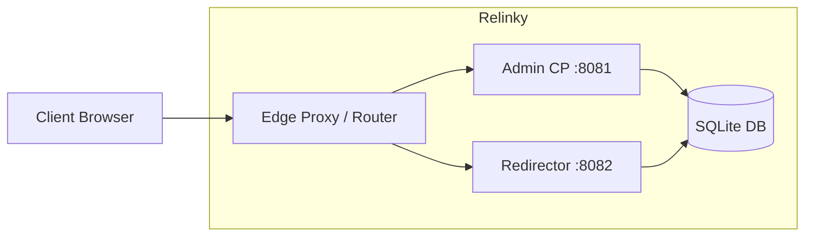
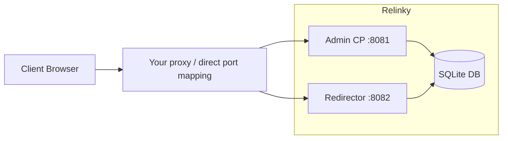
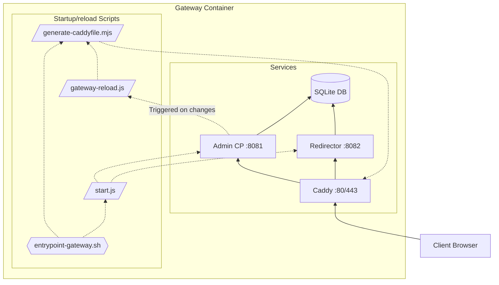
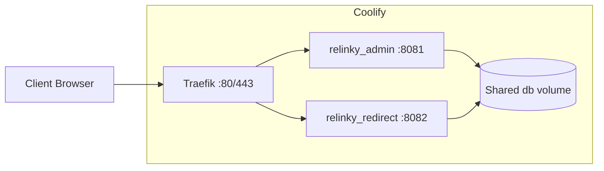

# Relinky

Lightweight self-hosted link redirector/shortener with admin UI, stats, SQLite storage and API for automation.

Allows for human-friendly redirects on your own domains — e.g. `go.example.com/docs` — that you can retarget later without updating it everywhere. Helps with branding links for marketing pipelines and just if you like human-friendly links and have a domain of your own.

### Features

- Multiple domains
- Link expiration
- Support for links with hash parts
- Optional query string forwarding
- Basic stats overview (full stats recording)
- API for automation with source IP restrictions
- JSON Import/export in UI
- Importing from Rebrandly and Kutt
- Responsive admin UI for desktop and mobile


### Table of contents

- [Architecture overview](#architecture-overview)
- [Setup](#setup)
- [Pre-built image (GHCR)](#pre-built-image-ghcr)
- [Hosting modes](#hosting-modes)
  - [1. Plain Docker](#mode-1-plain-docker-docker-composeyml)
  - [2. Gateway, embedded Caddy](#mode-2-gateway-embedded-caddy-docker-composegatewayyml)
  - [3. Coolify](#mode-3-coolify--traefik-docker-composecoolifyyml)
- [Domains: global and per-domain defaults](#domains-global-and-per-domain-defaults)
- [External Automation API](#external-automation-api)
- [Configuration Reference](#configuration-reference)
- [Development](#development)
- [Future plans](#future-plans)
- [Support](.github/SUPPORT.md)
- [MIT License](#mit-license)


## How the admin panel looks

<table>
<tr>
    <td>Desktop</td>
    <td>Mobile</td>
</td>
<tr>
    <td></td>
    <td></td>
</tr>
</table>
    

## Architecture overview


```mermaid
flowchart LR
    client[Client Browser]
    subgraph relinky [Relinky]
        router[Edge Proxy / Router]
        admin[Admin CP :8081]
        redirect[Redirector :8082]
        db[(SQLite DB)]
        router --> admin
        router --> redirect
        admin --> db
        redirect --> db
    end
    client --> router
```

Databases:

- `db/main.db` — settings/defaults/api keys
- `db/redirectables.db` — domains/links/target URLs
- `db/stats.db` — redirect stats
- `db/logs.db` — audit-like logs

---

## Setup

Same overall path regardless of how you host:

1. **Choose a hosting mode** — [Plain Docker](#mode-1-plain-docker-docker-composeyml) if you already have a front-end proxy; [Gateway](#mode-2-gateway-embedded-caddy-docker-composegatewayyml) if Relinky should run Caddy and get certificates itself; [Coolify](#mode-3-coolify--traefik-docker-composecoolifyyml) if you use it either as a service or self-hosted.
2. **Run Relinky** — pull a [pre-built image](#pre-built-image-ghcr) or build from the compose file. Commands for each option are in the mode sections below.
3. **Keep `db/` persistent** — all SQLite files live there; mount/keep that directory across upgrades.
4. **DNS** — point admin and redirect domains to your Relinky instance server and set up domain routing on your server so the requests reach Relinky services. You need at least two domains — for admin UI and for redirects, it can't be the same domain. For example, `links.com` for both — won't work; `admin.links.com` and `links.com` will work fine as well as `relinky.company.com` for admin UI and `go.company.com` for links.
5. **Admin password** — you'll set it during onboarding on first visit. You can also seed a hash via env before start (see below).
6. **Add links** — in the admin UI under **Links** (also the main page).
7. **Import old links** — upload your JSONs or CSVs in **Tools**, there's pre-check before actual import so you know precisely what will happen.
8. **Have fund and grow** — you can add more domains under **Domains** and API keys under **Tools** if you automate. Don't forget to point your new domains to the server and configure the server itself so it knows that these domains should be routed to Relinky.

### Admin password

On first visit, if no password exists in the database, Relinky shows **onboarding**: set a password and your first redirect domain. When the password is set normal login page is shown.

To pre-seed a password instead, generate the hash:

```bash
npm run hash-password -- 'your-password'
```

Or:

```bash
openssl passwd -6 'your-password'
```

If the platform mangles `$` in env values (Coolify does):

```bash
npm run hash-password -- 'your-password' --b64
```

Then set `RELINKY_ADMIN_PASSWORD_HASH` or `RELINKY_ADMIN_PASSWORD_HASH_B64`. On every startup the migrator **copies this hash into the database** (overwriting any in-app password change). Remove the env var to manage the password only from the admin UI (**Tools → Password**).

If neither env nor onboarding has run yet, the admin UI stays on onboarding until a password is set.

---

## Pre-built image (GHCR)

Multi-arch images (`linux/amd64`, `linux/arm64`) are published to [GitHub Container Registry](https://docs.github.com/en/packages/working-with-a-github-packages-registry/working-with-the-container-registry) as `ghcr.io/artyomxx/relinky`.

| Git ref | Role | Image tags |
|---------|------|------------|
| `main` | Development | `dev`, `main`, `main-<sha>` |
| `release` | Stable line | `latest`, `stable`, `release`, `release-<sha>` |
| `v1.2.3` (git tag) | Pinned release | `1.2.3`, `1.2`, `1`, `latest`, `stable`, `<sha>` |

Prefer `:latest` / `:stable` for production. Use `:dev` to try what’s on `main`. Pin a semver tag when you want a fixed build.

```bash
docker pull ghcr.io/artyomxx/relinky:latest
docker pull ghcr.io/artyomxx/relinky:dev
```

Compose picks the image from `RELINKY_IMAGE` (defaults to a local `relinky:local` build). How to pass that into each deploy style is under [Hosting modes](#hosting-modes).

---

## Hosting modes

### Mode 1: Plain Docker ([`docker-compose.yml`](./docker-compose.yml))


```mermaid
flowchart LR
    client[Client Browser] --> edgeProxy[Your proxy / direct port mapping]
    subgraph relinky [Relinky]
        admin[Admin CP :8081]
        redirect[Redirector :8082]
        db[(SQLite DB)]
        admin --> db
        redirect --> db
    end
    edgeProxy --> admin
    edgeProxy --> redirect
```

Use when:

- You already have your own reverse proxy/TLS setup
- Or local/dev usage where you do not need automatic TLS

Build from source:

```bash
docker compose up -d --build
```

Or run a pre-built image (no local build):

```bash
export RELINKY_IMAGE=ghcr.io/artyomxx/relinky:latest
docker compose pull
docker compose up -d --no-build
```

Admin listens on port `8081`, redirector on `8082` (or whatever you set in env). Point your proxy to these ports (at least the admin domain), open the admin domain, complete onboarding and you're good to go.

### Mode 2: Gateway, embedded [Caddy](https://github.com/caddyserver/caddy) ([`docker-compose.gateway.yml`](./docker-compose.gateway.yml))

Use when:

- You run on a VPS and want Relinky to manage routing/certs itself
- Host ports `80/443` are available (or intentionally remapped)


```mermaid
flowchart BT
client[Client Browser]
    subgraph relinky [Gateway Container]
        subgraph scripts [Startup/reload Scripts]
            entrypoint{{entrypoint-gateway.sh}}
            startScript[/start.js/]
            genScript[/generate-caddyfile.mjs/]
            reloadHelper[/gateway-reload.js/]

            entrypoint -.-> startScript
            entrypoint -.-> genScript       
            reloadHelper -.-> genScript
        end

        subgraph services [Services]
            db[(SQLite DB)]
            caddy[Caddy :80/443]
            admin[Admin CP :8081]
            redirect[Redirector :8082]

            admin --> db
            redirect --> db
            caddy --> admin
            caddy --> redirect
        end

        startScript -.-> admin
        startScript -.-> redirect
        admin -. Triggered on changes .-> reloadHelper
        genScript -.-> caddy
    end
    client --> caddy
```

#### Workflow

1. Container entrypoint starts and sets gateway defaults (loopback binds + Caddyfile path).
2. Entrypoint runs DB init and generates the initial Caddyfile from current DB domains.
3. Entrypoint starts Node services (`start.js`) and Caddy (`caddy run ...`).
4. When domains are created/removed in admin API, backend schedules a non-blocking gateway reload.
5. Reload helper regenerates Caddyfile from DB and executes `caddy reload`.

Script pointers for this flow:

- [`docker/entrypoint-gateway.sh`](./docker/entrypoint-gateway.sh) (startup order, process launch)
- [`start.js`](./start.js) (spawns admin + redirector)
- [`scripts/generate-caddyfile.mjs`](./scripts/generate-caddyfile.mjs) (reads DB domains, writes Caddyfile)
- [`app/shared/gateway-reload.js`](./app/shared/gateway-reload.js) (regenerate + `caddy reload` on domain changes)
- [`app/admin/backend/api.js`](./app/admin/backend/api.js) (calls `scheduleGatewayReload()` after domain mutations)

#### Setup

Required environment variables:

- `RELINKY_ADMIN_HOST`
- `RELINKY_ACME_EMAIL`

Build from source:

```bash
export RELINKY_ADMIN_HOST='admin.example.com'
export RELINKY_ACME_EMAIL='you@example.com'
# optional: export RELINKY_ADMIN_PASSWORD_HASH='...'
docker compose -f docker-compose.gateway.yml up -d --build
```

Or a pre-built image:

```bash
export RELINKY_IMAGE=ghcr.io/artyomxx/relinky:latest
export RELINKY_ADMIN_HOST='admin.example.com'
export RELINKY_ACME_EMAIL='you@example.com'
docker compose -f docker-compose.gateway.yml pull
docker compose -f docker-compose.gateway.yml up -d --no-build
```

After startup:

1. Go to your admin domain
2. Complete onboarding (first visit) or log in if a password was seeded
3. Optionally add more redirect domains in **Domains**
4. Ensure all domains resolve to the same server
5. Relinky regenerates Caddy config and reloads Caddy automatically

Port/cert notes:

- Let’s Encrypt HTTP-01/TLS-ALPN needs public `80/443`
- For non-standard public ports, use `RELINKY_CADDY_TLS_INTERNAL=1` for self-signed/internal TLS
- `RELINKY_CADDY_HTTP_PORT`/`RELINKY_CADDY_HTTPS_PORT` control Caddy bind ports inside container
- `RELINKY_GATEWAY_HOST_HTTP`/`RELINKY_GATEWAY_HOST_HTTPS` control published host ports

### Mode 3: [Coolify](https://github.com/coollabsio/coolify) / Traefik ([`docker-compose.coolify.yml`](docker-compose.coolify.yml))

Use when:

- You use Coolify as a service or self-hosted

Do not use gateway mode here unless you intentionally want double proxy.

Why split services:

- Coolify domain mapping is per service
- Admin and redirector need separate upstream targets (`8081`, `8082`)


```mermaid
flowchart LR
    client[Client Browser]
    subgraph coolify [Coolify]
        traefik[Traefik :80/443]
        traefik --> admin[relinky_admin :8081]
        traefik --> redirect[relinky_redirect :8082]
        admin --> SharedDb[(Shared db volume)]
        redirect --> SharedDb
    end
    client --> traefik
```

Checklist:

1. Create an app from a public Github repo or your private clone.
2. Build pack: Docker Compose, file [`docker-compose.coolify.yml`](./docker-compose.coolify.yml). Coolify often defaults to `.yaml` — rename or point it at this `.yml` file.
3. Ensure persistent storage for `./db` is attached to the migrate/admin/redirect services (usually automatic).
4. Set admin and redirect domains in Coolify and in Relinky:
   - Admin service: one admin hostname, e.g. `https://admin.example.com:8081`
   - Redirect service: one or many redirect hostnames, e.g. `https://link.example.com:8082, https://dl.example.com:8082`
   - Coolify expects full URLs with protocol (e.g. `https://`) and port (e.g. `:8081`) as above, not bare domains.
5. Deploy the project, open your admin domain (e.g. `admin.example.com`) in browser and complete onboarding: set password and add first redirect domain. More domains may be added under **Domains** when you log in after onboarding.

---

## Domains: global and per-domain defaults

The **Domains** page has two layers:

1. **Global defaults** (`GET/PUT /api/domains/defaults`) — default domain, link defaults (expired URL, redirect code, keep referrer/query), and global error redirect URLs (`error_404_url`, `error_500_url` in `main.db`).
2. **Per-domain overrides** (`GET/PUT /api/domains/:id`) — optional values on each redirect hostname. `null` means inherit from global. Partial `PUT` updates only the fields you send; `null` clears an override.

At redirect time the redirector resolves **link → domain → global** for link fields (`redirect_code`, `keep_referrer`, `keep_query_params`, expired URL). Unknown slugs use **domain → global** error URLs; an unknown hostname uses global error URLs only.

Links can store `null` on those fields to inherit (set **Default** in the link form). Existing links keep their stored values until edited.

---

## External Automation API

Create keys in **Tools → API keys**.

Capabilities:

- Links: list/create/update/delete
- Stats: read
- Optional IP allowlist per key (exact IP and CIDR)

Link fields `redirect_code`, `keep_referrer`, and `keep_query_params` accept JSON `null` on create/update to inherit (link → domain → global). List responses return `null` for inherit; `false`/`0` means explicitly off.

Domain defaults and per-domain overrides are admin-only (not exposed on external routes).

Auth format:

```bash
Authorization: Bearer rk_<keyId>.<secret>
```

Endpoints:

- Get links: `GET /api/external/links?page=1&limit=100&search=...`
- Create link: `POST /api/external/links`
- Edit link: `PUT /api/external/links/:id`
- Delete link: `DELETE /api/external/links/:id`
- Get stats: `GET /api/external/stats?period=day|week|month|year|all&linkId=<id>`

Examples:

```bash
API_KEY='rk_xxx.yyy'
BASE='https://admin.example.com'

# Get 50 links
curl -sS -H "Authorization: Bearer $API_KEY" "$BASE/api/external/links?page=1&limit=50"

# Create 'go.example.com/promo-2026' link leading to 'https://example.com/landing' with 303 HTTP code
curl -sS -X POST "$BASE/api/external/links" \
    -H "Authorization: Bearer $API_KEY" \
    -H "Content-Type: application/json" \
    -d '{"domain":"go.example.com","slug":"promo-2026","url":"https://example.com/landing","redirect_code":303}'

# Create link that inherits redirect code and bool defaults from domain/global settings
curl -sS -X POST "$BASE/api/external/links" \
    -H "Authorization: Bearer $API_KEY" \
    -H "Content-Type: application/json" \
    -d '{"domain":"go.example.com","slug":"inherit-settings","url":"https://example.com/x","redirect_code":null,"keep_referrer":null,"keep_query_params":null}'
```

---

## Configuration Reference

Check [`.env.example`](./.env.example) file.

All Relinky settings use a `RELINKY_` prefix. Older unprefixed names (`ADMIN_PASSWORD_HASH`, `ADMIN_PORT`, `ACME_EMAIL`, …) still work if the new name is unset; Relinky logs a one-time deprecation warning and will remove those aliases later — rename when you can.

### Common (all modes)

Optional (seeds the DB password on every migrator run; omit to use onboarding or **Tools → Password**):

- `RELINKY_ADMIN_PASSWORD_HASH` — Raw sha512-crypt admin password hash (`$6$...`). Copied into the `auth` table on startup (overwrites). Login always checks the database, not env directly.
- `RELINKY_ADMIN_PASSWORD_HASH_B64` — Base64 form of the same hash; use when your platform mangles `$` characters (e.g. Coolify).

Optional:

- `RELINKY_ADMIN_LOGIN_DEBUG` — Enables verbose admin login diagnostics in logs (`1`, `true`, `yes`).
- `RELINKY_ADMIN_PASSWORD_SHA512_ROUNDS` — Hash rounds used by the local hash-generation script.
- `RELINKY_ADMIN_IP` — Bind address for admin HTTP server.
- `RELINKY_ADMIN_PORT` (default `8081`) — Listen port for admin HTTP server.
- `RELINKY_REDIRECTOR_IP` — Bind address for redirector HTTP server.
- `RELINKY_REDIRECTOR_PORT` (default `8082`) — Listen port for redirector HTTP server.
- `RELINKY_DB_DIR` — Override the SQLite database directory (defaults to the repo-local `db/`). Useful for isolated test runs or non-standard layouts; in Docker the `db/` volume is the persistent location.
- `RELINKY_DB_BUSY_TIMEOUT_MS` (default `5000`) — How long a SQLite connection waits for a busy database lock before erroring. The admin and redirector both run migrations on boot, so this lets the second writer wait instead of failing with `SQLITE_BUSY`.
- `RELINKY_DB_BACKUP_KEEP` (default `10`, `0` = keep all) — How many pre-migration backups to retain per database in `db/backups/`. Older snapshots beyond this count are pruned automatically.

### Gateway mode only ([`docker-compose.gateway.yml`](./docker-compose.gateway.yml))

Required:

- `RELINKY_ADMIN_HOST` — Public hostname for the admin UI.
- `RELINKY_ACME_EMAIL` — Contact email used by Caddy/ACME for [Let's Encrypt](https://en.wikipedia.org/wiki/Let%27s_Encrypt) registration.

Optional:

- `RELINKY_HTTP_ONLY` — Force HTTP-only mode (no TLS/cert issuance).
- `RELINKY_ACME_STAGING` — Use Let's Encrypt staging endpoint (safe for testing rate limits).
- `RELINKY_CADDY_HTTP_PORT` — Internal container HTTP port where Caddy listens.
- `RELINKY_CADDY_HTTPS_PORT` — Internal container HTTPS port where Caddy listens.
- `RELINKY_GATEWAY_HOST_HTTP` — Host port published to `RELINKY_CADDY_HTTP_PORT`.
- `RELINKY_GATEWAY_HOST_HTTPS` — Host port published to `RELINKY_CADDY_HTTPS_PORT`.
- `RELINKY_CADDY_TLS_INTERNAL` — Use Caddy internal CA/self-signed certs instead of ACME certs.
- `RELINKY_CADDYFILE_PATH` (default `/app/caddy/Caddyfile`) — Filesystem path where generated Caddyfile is written/read.

### Coolify mode only ([`docker-compose.coolify.yml`](./docker-compose.coolify.yml))

Optional (pre-seed or reset password from env):

- `RELINKY_ADMIN_PASSWORD_HASH_B64` — Base64-encoded password hash.
  Don't use the normal `RELINKY_ADMIN_PASSWORD_HASH` with Coolify! It mangles `$` symbols in env variables as of April 2026.

---

## Development

```bash
npm install
cp .env.example .env
npm run build
npm run dev
npm run test:spec
```

`npm run dev` runs migrations/seed once (`dev:prepare`), then watches `app/admin/backend/server.js` and `app/redirector/server.js` (plus Vite). Do **not** watch `start-dev.js` / `start.js` — Node's supervisor + `--watch` + spawned children loops on macOS. `dev:backend` (no watch) still uses `start-dev.js` if you only need the API processes. Loads [`.env`](./.env) via `--env-file-if-exists`. For normal local work, uncomment the dev `RELINKY_ADMIN_PASSWORD_HASH` in `.env` (password `dev`). To test onboarding, leave it unset and start with an empty `db/` directory.

### Database migrations

Schema changes are applied automatically — no manual step. Each SQLite file tracks its own version (`PRAGMA user_version`) and only the missing migrations run, inside a transaction, so existing databases upgrade in place without data loss. Migrations live in [`app/shared/migrations/`](./app/shared/migrations) and are run by [`app/shared/init-db.js`](./app/shared/init-db.js); to add one, append it to the relevant file's list.

Migrations run **once per deployment as a dedicated step**, not inside each service: the all-in-one image runs them in [`start.js`](./start.js) (and the gateway entrypoint) before launching the admin and redirector; the multi-container Coolify compose uses a one-shot `relinky_migrate` service that the others wait on (`depends_on: condition: service_completed_successfully`). The admin and redirector then only **verify** the schema is current on boot and exit with an error if a migration was skipped — they never migrate concurrently, which avoids `SQLITE_BUSY` on a shared volume.

Before upgrading a database that already has data, init-db takes a consistent snapshot (via SQLite's online backup) into a `backups/` folder inside the database directory — `db/backups/` by default, or `$RELINKY_DB_DIR/backups/` when that override is set — named `<db>.<timestamp>.v<from-version>.<pid>.db`. Backups are only created when a migration is actually pending, never on a fresh install or an ordinary restart. If the backup cannot be written, startup aborts rather than migrating without a restore point. Retention is controlled by `RELINKY_DB_BACKUP_KEEP`.

To restore a snapshot: stop the services, replace the live file (e.g. copy `db/backups/main.<…>.db` over `db/main.db`), delete any leftover `db/main.db-wal` / `db/main.db-shm`, then start again.

After switching Node versions, rebuild the native SQLite binding: `npm rebuild better-sqlite3`.

---

## Future plans

1. There's a lot of meta information recorded when links are redirected, all very useful for good stats and analytics. At the same time the stats view is still in its most basic form yet.
2. It's being used in 'production' by myself for my own personal needs, and works well, but I can't guarantee it'll work well under very heavy load, though why not — it's very simple. That's something I'd love to see some feedback on and potentially improve if needed. For example, a *blazing fast* front-end router could be introduced, as well as the redirector could be rewritten with something more efficient than JS.
3. The rest depends on feedback.

---

## Support

See [`.github/SUPPORT.md`](.github/SUPPORT.md) (donations) or [get in touch](https://artyom.cc).

---

## MIT License

Permission is hereby granted, free of charge, to any person obtaining a copy of this software and associated documentation files (the “Software”), to deal in the Software without restriction, including without limitation the rights to use, copy, modify, merge, publish, distribute, sublicense, and/or sell copies of the Software, and to permit persons to whom the Software is furnished to do so, subject to the following conditions:

The above copyright notice and this permission notice shall be included in all copies or substantial portions of the Software.

THE SOFTWARE IS PROVIDED “AS IS”, WITHOUT WARRANTY OF ANY KIND, EXPRESS OR IMPLIED, INCLUDING BUT NOT LIMITED TO THE WARRANTIES OF MERCHANTABILITY, FITNESS FOR A PARTICULAR PURPOSE AND NONINFRINGEMENT. IN NO EVENT SHALL THE AUTHORS OR COPYRIGHT HOLDERS BE LIABLE FOR ANY CLAIM, DAMAGES OR OTHER LIABILITY, WHETHER IN AN ACTION OF CONTRACT, TORT OR OTHERWISE, ARISING FROM, OUT OF OR IN CONNECTION WITH THE SOFTWARE OR THE USE OR OTHER DEALINGS IN THE SOFTWARE.
